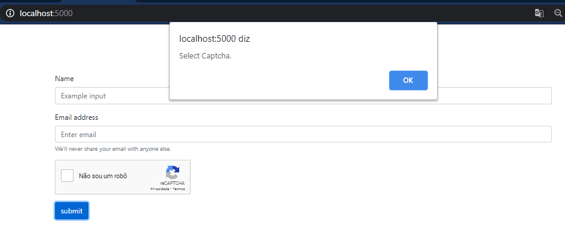
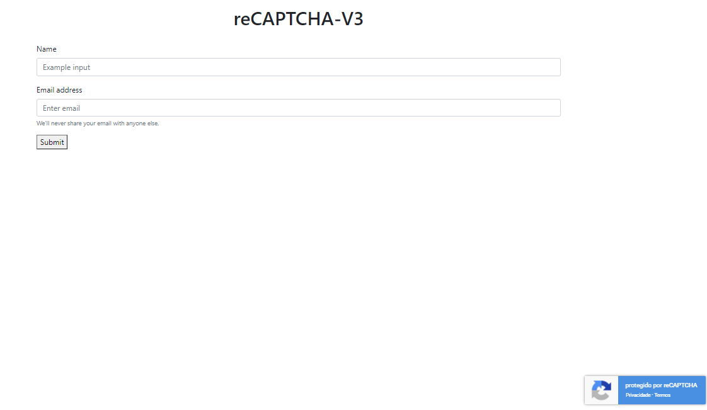

# reCAPTCHA
Google's reCaptcha v2 and v3 in a client-server environment with Node.js. 

### Change site key and secret key of your site, you can get this here * [reCAPTCHA](https://www.google.com/recaptcha/about/).

#### reCAPTCHA V2

#### reCAPTCHA V3

